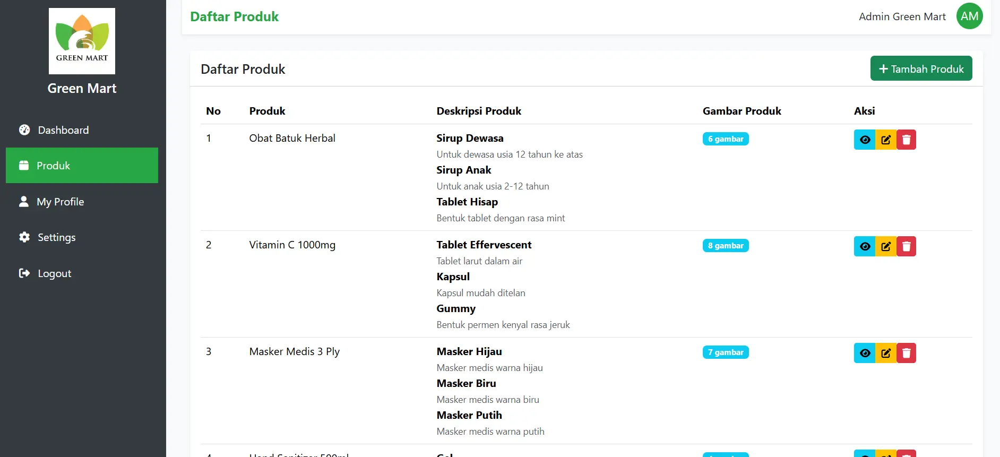
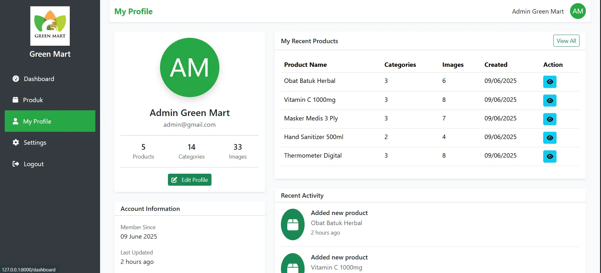

<h1 align="center">
🍃 Green Mart - Product Management System
</h1>

<div align="center">


</div>

<p align="center">
Green Mart is a comprehensive product management system designed specifically for Green Mart's needs. Built with Laravel 12, featuring dynamic product management, category organization, and image upload capabilities.

</p>

## Overview

Below are screenshots showcasing the Product Management interface and functionality:




## ✨ Features

### 🎯 Core Features

-   **User Authentication**: Secure login and registration system with email verification.
-   **Product Management**: Create, read, update, and delete products with a maximum of 5 products per user.
-   **Category System**: Add up to 3 categories per product with descriptions.
-   **Image Upload**: Multiple image uploads per category (JPG, JPEG, PNG supported).
-   **SEO-Friendly URLs**: Slug-based routing for better SEO optimization.
-   **Responsive Design**: Mobile-first approach with Bootstrap 5.

### 🚀 Additional Features

-   **Landing Page**: Beautiful homepage with statistics and feature showcase.
-   **User Profile**: Comprehensive profile page with activity timeline.
-   **Sidebar Navigation**: Easy-to-use navigation system.
-   **Real-time Validation**: Dynamic form validation and notifications.
-   **Auto-increment Numbering**: Automatic product numbering system.
-   **Bulk Operations**: Delete multiple products at once.
-   **Search & Filter**: Find products quickly.
-   **Export/Import**: Excel, CSV, PDF, JSON support.

### 🛡️ Security Features

-   **CSRF Protection**: Cross-Site Request Forgery protection.
-   **XSS Prevention**: Input sanitization and output escaping.
-   **SQL Injection Protection**: Eloquent ORM and prepared statements.
-   **Authentication Guards**: Route middleware protection.
-   **Password Hashing**: Bcrypt password encryption.

## 📦 Requirements

### System Requirements

-   PHP >= 8.2
-   Composer >= 2.0
-   Node.js >= 14.x
-   NPM >= 6.x or Yarn
-   MySQL >= 8.0 or PostgreSQL >= 12

### PHP Extensions

-   BCMath PHP Extension
-   Ctype PHP Extension
-   cURL PHP Extension
-   DOM PHP Extension
-   Fileinfo PHP Extension
-   JSON PHP Extension
-   Mbstring PHP Extension
-   OpenSSL PHP Extension
-   PDO PHP Extension
-   Tokenizer PHP Extension
-   XML PHP Extension
-   GD PHP Extension (for image processing)

## 🔧 Installation

1. **Clone the Repository**

```bash
git clone https://github.com/yourusername/green-mart.git
cd green-mart
```

2. **Install PHP Dependencies**

```bash
composer install
```

3. **Install Node Dependencies**

```bash
npm install
```

4. **Environment Setup**

```bash
cp .env.example .env
php artisan key:generate
```

5. **Database Configuration**
    > Update your `.env` file with database credentials:

```bash
DB_CONNECTION=mysql
DB_HOST=127.0.0.1
DB_PORT=3306
DB_DATABASE=db_green_mart
DB_USERNAME=root
DB_PASSWORD=your_password
```

6. **Create Database**

```bash
CREATE DATABASE db_green_mart CHARACTER SET utf8mb4 COLLATE utf8mb4_unicode_ci;
```

7. **Run Migrations & Seeders**

```bash
php artisan migrate:fresh --seed
```

8. **Create Storage Link**

```bash
php artisan storage:link
```

> #### If the Command Doesn’t Work
>
> If `php artisan storage:link` doesn't work, and the path contains `!`, create the symbolic link manually using PowerShell:
>
> 1. Open PowerShell as Administrator.
> 2. Run this command:
>
> ```bash
> New-Item -ItemType SymbolicLink -Path "D:\Path\To\Your\Project\public\storage" -Target "D:\Path\To\Your\Project\storage\app\public"
> ```

9. **Build Assets**

```bash
npm run build
# Or for development
npm run dev
```

10. **Start the Application**

```bash
php artisan serve
```

> Visit `http://localhost:8000` in your browser.

4. **Environment Setup**

```bash
cp .env.example .env
php artisan key:generate
```

# Product Management

### Add Product (Maximum 5 per user)

1. Click "Tambah Produk" button.
2. Enter product name.
3. Product will be automatically numbered.

### Add Categories (Maximum 3 per product)

1. Click "Tambah Kategori" on product.
2. Enter category name and description.
3. Categories are product-specific.

### Upload Images

1. Click upload button for each category.
2. Select JPG, JPEG, or PNG files.
3. Multiple images per category allowed.
